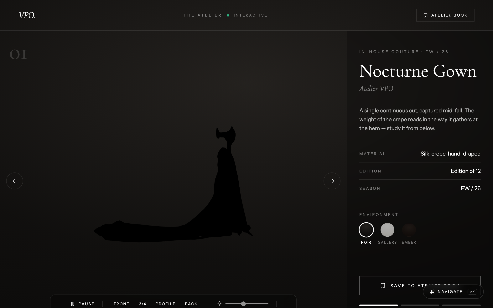
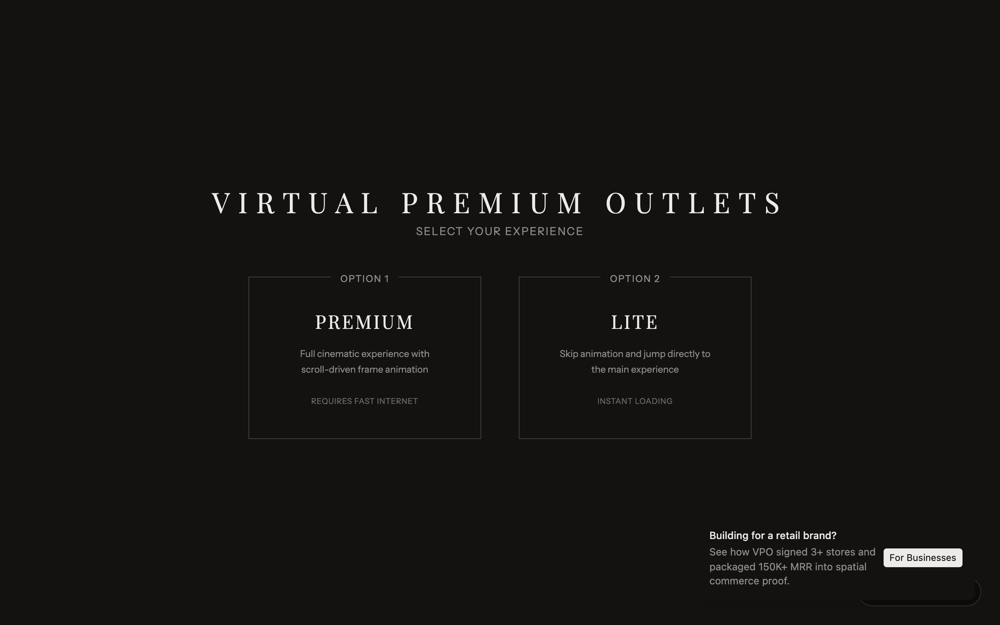
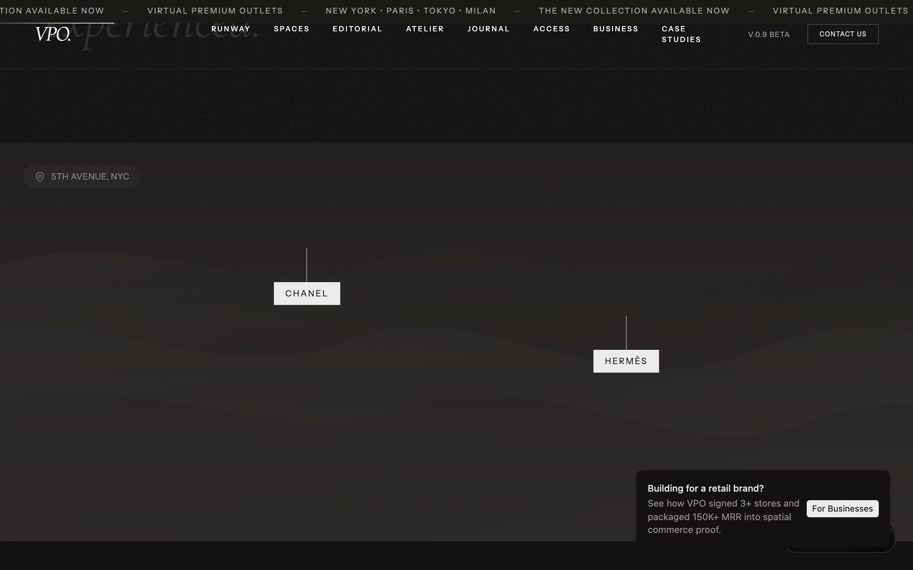
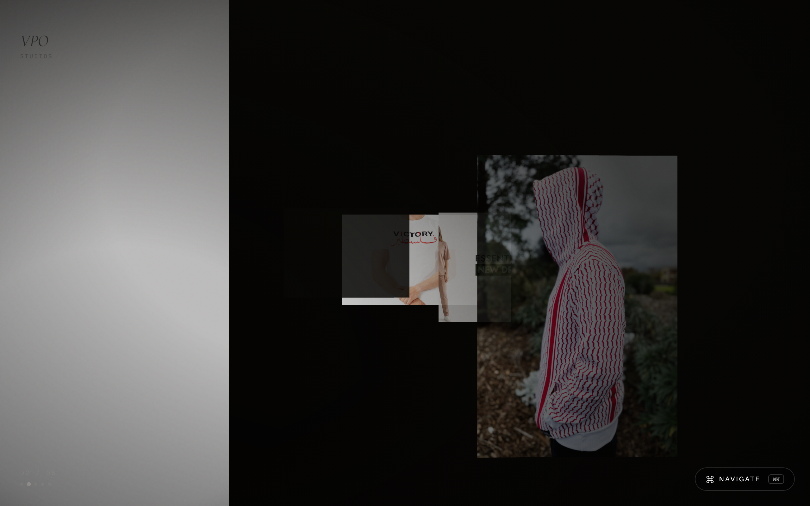

# VPO — Virtual Private Outlet

<p align="center">
  <a href="https://vpo.techrealm.ai"></a>
  
  
  
  
  
  
</p>

> _Fashion is not just seen. It is entered._

VPO is a browser-native luxury fashion destination — part editorial, part showroom,
part members-only club. Think of it as a digital flagship you don't just *look* at, you
*walk into*: a cinematic, scroll-driven experience where high-end fashion is staged
through 3D model viewers, frame-sequence animations, and glassmorphic UI.

No headset. No download. Just open a tab and step onto the runway.

<p align="center">
  
</p>

<p align="center">
  <em>Scroll the cinematic, hit <kbd>⌘K</kbd> to teleport anywhere, and step into The Atelier.</em>
</p>

---

## ✨ What's new in this release

The experience just got deeper, faster, and a lot more keyboard-friendly. Highlights:

- **🪡 The Atelier** — a brand-new interactive 3D showroom at [`/atelier`](https://vpo.techrealm.ai/atelier).
  Orbit couture pieces, switch the lighting environment (**Noir / Gallery / Ember**), nudge the
  exposure, and **save your favorites to a personal Atelier Book** that persists between visits.
- **⌘K Command Palette** — press <kbd>⌘K</kbd> / <kbd>Ctrl+K</kbd> anywhere to jump between
  Runway, Spaces, The Atelier, Business, Journal and more without touching the mouse.
- **📖 Reading progress + back-to-top** — a hairline progress indicator tracks how far you've
  scrolled, and a graceful back-to-top control appears when you've wandered deep.
- **♿ Reduced-motion & a11y** — respects the OS *"reduce motion"* setting (skips the 226-frame
  cinematic for a calm static hero), adds a skip-to-content link and sharper keyboard focus rings.
- **⚡ Leaner & faster** — route-level code-splitting means the landing route no longer ships the
  ~1.1 MB Three.js bundle up front; heavy pages load only when you visit them.
- **🧪 A/B hero variant** — append [`?variant=b`](https://vpo.techrealm.ai/?variant=b) to preview
  an alternate version-selector treatment. See [`docs/hero-ab-variants.md`](docs/hero-ab-variants.md).
- **🔎 Discoverable & installable** — full SEO/OpenGraph + JSON-LD metadata, a sitemap, robots,
  and a complete favicon + web-manifest set so VPO installs like an app.
- **✅ Tests + CI** — a Vitest unit/component suite and a Playwright e2e smoke suite, wired into
  GitHub Actions.

---

## Why it's cool

- **It's a whole world, not a page.** A scroll-triggered frame sequence zooms you into the
  environment, then hands you off to a manifesto, a spatial map, a live runway, and an
  editorial gallery — each section pulling you a little deeper.
- **Real 3D, right in the browser.** Product pieces render as GLB/GLTF models via React
  Three Fiber + Drei. Drag them, spin them, get uncomfortably close to the stitching.
- **Two ways in.** A **Premium** mode with the full cinematic frame animation, and a
  **Lite** mode that skips straight to the goods for anyone on hotel Wi-Fi.
- **A runway with a lobby.** The broadcast section lets you spin up a private viewing room,
  invite friends, and pick a show together — because a front-row seat is better with company.
- **Editorial to the bone.** Grain overlays, serif/sans pairings, uppercase micro-labels, and
  a dark-first palette that treats whitespace like a luxury good.

---

## A peek inside

<p align="center">
  
  <br /><em><strong>The Atelier</strong> (new) — orbit couture in real time, swap the light, and save pieces to your Atelier Book.</em>
</p>

|  |  |
|---|---|
|  |  |
| **Choose your way in** — Premium (full cinematic) or Lite (instant). | **The spatial store** — brand waypoints across a 5th-Avenue map. |
|  |  |
| **Manifesto** — the full-bleed thesis statement. | **Current Selection** — curated pieces with hover-reveal imagery. |
|  |  |
| **The Runway** — live show schedule + private lobbies. | **Access** — tiered membership, editorial-style. |
|  |  |
| **Gallery / Editorial** — 3D viewers in a warm-toned layout. | **VPO for Business** — the spatial-commerce pitch. |

### Fits in your pocket, too

VPO is fully responsive — the desktop mega-nav folds into a full-screen mobile drawer, and
the hero swaps in a lighter mobile background so phones don't choke on the big art.

<p align="center">
  
  &nbsp;&nbsp;
  
</p>

---

## What's inside (section by section)

- **Landing & Hero** — scroll-triggered canvas frame sequence (GSAP ScrollTrigger).
- **Manifesto** — full-bleed typographic vision statement.
- **Spaces** — a map-style grid with brand waypoints you can hover to preview.
- **Current Selection** — a curated piece list with large hover-reveal imagery.
- **The Runway** — live broadcast schedule + a lobby system for shared viewing rooms.
- **Districts** — themed neighborhoods with architectural grid overlays.
- **Access / Membership** — a tiered model (Atelier tier) with playful perks.
- **Journal** — an editorial feed of essays on digital tactility and procedural design.
- **The Atelier** *(new)* — a standalone interactive 3D showroom (`/atelier`) with orbit
  controls, swappable lighting environments, an exposure dial, and a `localStorage`-backed
  Atelier Book for saving favorite pieces.
- **Gallery / Editorial** — a separate page with GLB/GLTF viewers and an immersive
  experience container.
- **Command palette** *(new)* — a global <kbd>⌘K</kbd> quick-navigation overlay.
- **Waitlist & Footer** — early-access email capture and the housekeeping.

---

## Tech stack

| Layer | Tool |
|-------|------|
| Framework | React 18 + TypeScript |
| Build | Vite 5 |
| Styling | Tailwind CSS 3.4 + `tailwindcss-animate` |
| Components | shadcn/ui (Radix primitives) |
| 3D | Three.js + React Three Fiber + Drei |
| Animation | GSAP (ScrollTrigger) |
| Routing | React Router v6 |
| Icons | Lucide React |

---

## Get it running (the no-assumptions guide)

New to all this? No sweat — here's every step, nothing skipped.

### 1. Prerequisites

- **Node.js 18 or newer.** Check what you have:
  ```sh
  node -v
  ```
  If that errors or shows something older than v18, grab the LTS build from
  [nodejs.org](https://nodejs.org). npm ships with it, so you're covered there too.

### 2. Get the code

```sh
git clone https://github.com/waleedsworld/vpo-3d-shopping-mall.git
cd vpo-3d-shopping-mall
```

### 3. Install the dependencies

```sh
npm install
```

(Grab a coffee — there's a full 3D + animation stack in here.)

### 4. Start the dev server

```sh
npm run dev
```

Vite prints a local URL (usually **http://localhost:8080**). Open it, and you're on the
runway. Edits hot-reload instantly.

### 5. Build for production (optional)

```sh
npm run build     # outputs to dist/
npm run preview   # serve the production build locally
```

That's it — no env vars, no secrets, no backend to babysit. It's a static front-end that
just runs.

### 6. Run the tests (optional)

```sh
npm run test           # Vitest unit / component tests (jsdom)
npm run test:coverage  # same, with a coverage report
npm run test:e2e       # Playwright end-to-end smoke tests (boots the dev server)
```

The unit suite (`src/**/*.test.tsx`) covers the `cn` class helper, the mobile
breakpoint hook, the `Button` primitive, `NavLink`, the version selector, and the
404 page. The e2e suite (`e2e/`) drives a real headless Chromium over the core
navigation flows. Both run automatically in CI — see `.github/workflows/ci.yml`.

---

## Handy routes

| Path | What you get |
|------|--------------|
| `/` | The main cinematic landing experience |
| `/?variant=b` | A/B alternate hero version-selector |
| `/atelier` | **The Atelier** — interactive 3D couture showroom + Atelier Book |
| `/gallery` | Editorial page with 3D model viewers |
| `/business` | VPO for Business (spatial-commerce pitch) |
| `/case-studies` | Case studies |
| `/blog` (`/journal`) | Editorial feed |

> **Tip:** press <kbd>⌘K</kbd> (macOS) or <kbd>Ctrl+K</kbd> (Windows/Linux) from anywhere to
> open the command palette and jump straight to any of these.

---

## Project structure (the map)

```
src/
├── pages/
│   ├── Index.tsx              # Main landing page
│   ├── GalleryEditorial.tsx   # Editorial / 3D gallery
│   ├── VPOBusiness.tsx        # For-business pitch page
│   └── ...
├── components/
│   ├── vpo/                   # All VPO-specific sections
│   │   ├── Navigation.tsx     # Desktop nav + mobile drawer
│   │   ├── ManifestoSection.tsx
│   │   ├── RunwaySection.tsx
│   │   ├── LobbyModal.tsx
│   │   └── ...
│   ├── gallery/               # 3D viewers & editorial components
│   ├── FrameSequence.tsx      # Canvas frame-sequence hero (Premium/Lite modes)
│   ├── ScrollReveal.tsx       # Reusable scroll-triggered reveal
│   └── ui/                    # shadcn/ui primitives
└── index.css                  # Global styles, grain overlays, editorial captions
```

---

## Live demo

**[vpo.techrealm.ai](https://vpo.techrealm.ai)** — step onto the runway. The build is a clean
static bundle (`npm run build` → `dist/`), so it deploys to any static host (Cloudflare Pages,
Netlify, Vercel, GitHub Pages) with zero server config.

---

## Status

**v0.9 Beta** — waitlist-only. Membership and lobby flows are polished placeholder UI; the
experience layer is the star of the show.

---

## License

This project is released under a **proprietary license** — see
[`PROPRIETARY-LICENSE/LICENSE.txt`](PROPRIETARY-LICENSE/LICENSE.txt). All rights reserved.
For reuse or licensing, reach out to the contacts listed there first.
