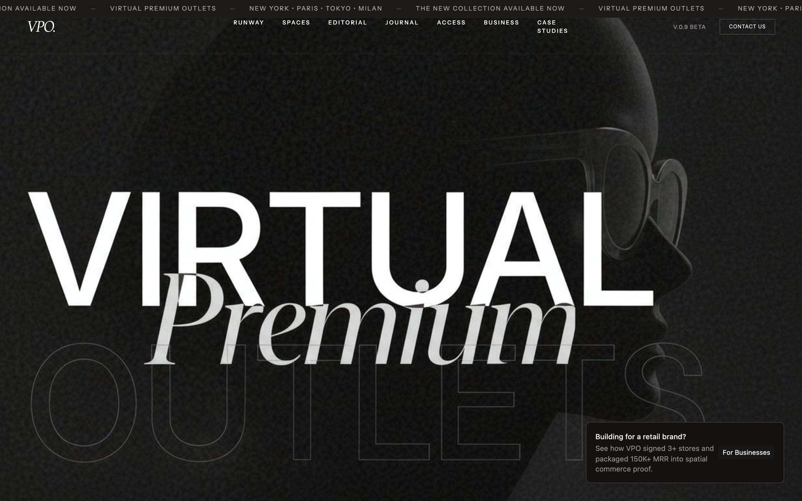
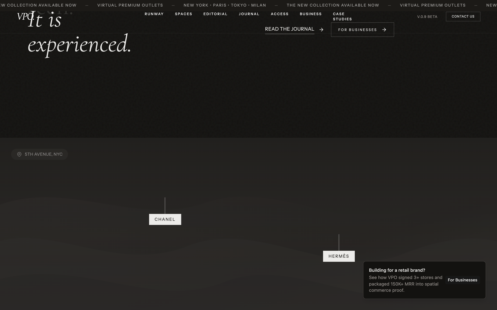
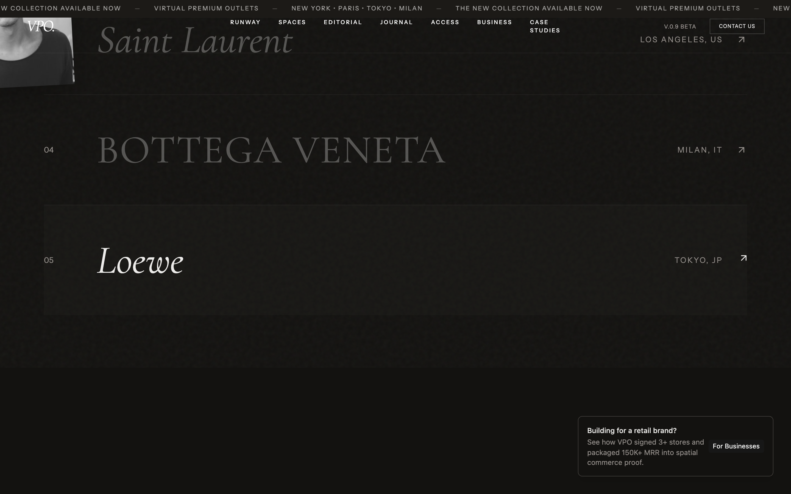
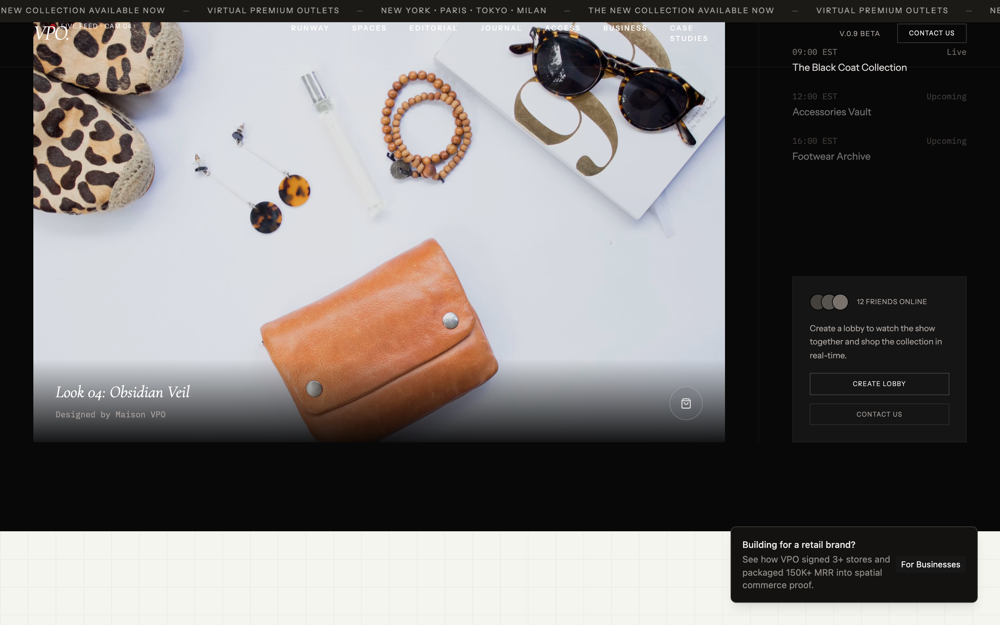
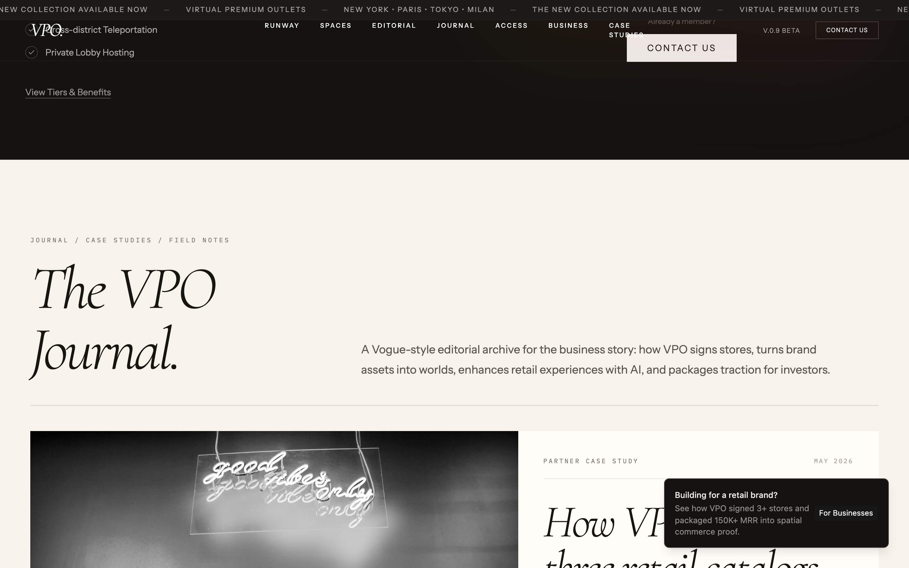
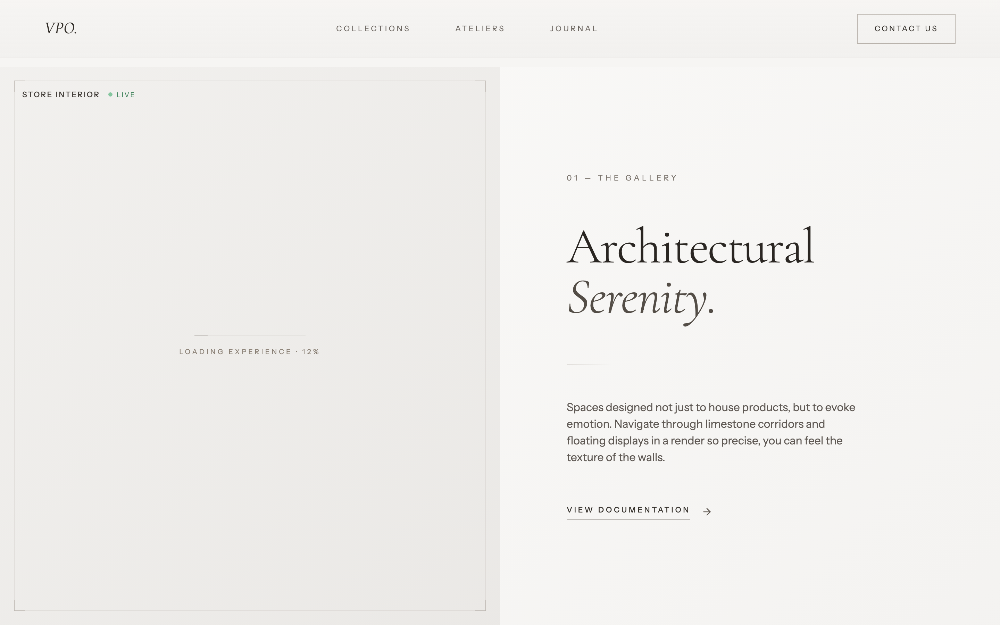
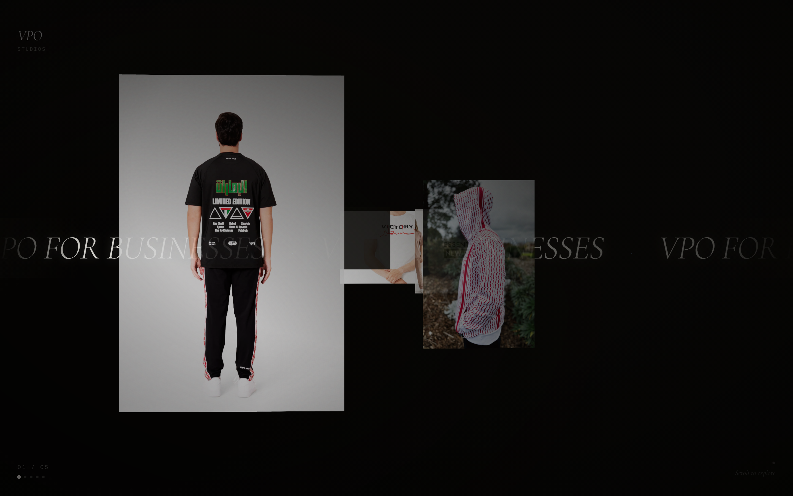
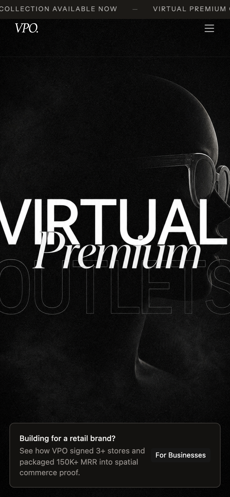
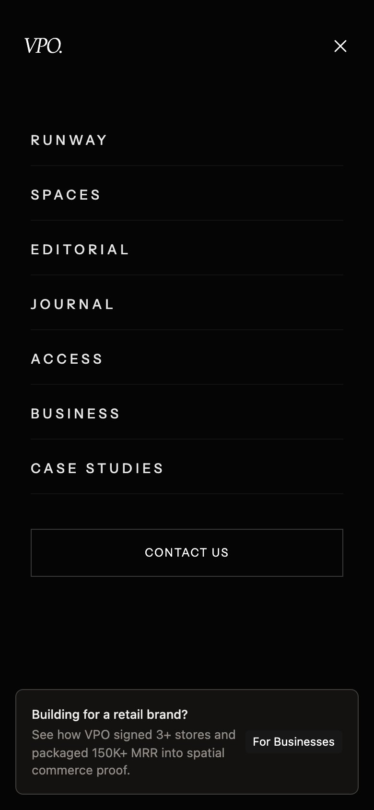

# VPO — Virtual Private Outlet

> _Fashion is not just seen. It is entered._

VPO is a browser-native luxury fashion destination — part editorial, part showroom,
part members-only club. Think of it as a digital flagship you don't just *look* at, you
*walk into*: a cinematic, scroll-driven experience where high-end fashion is staged
through 3D model viewers, frame-sequence animations, and glassmorphic UI.

No headset. No download. Just open a tab and step onto the runway.

<p align="center">
  
</p>

---

## Why it's cool

- **It's a whole world, not a page.** A scroll-triggered frame sequence zooms you into the
  environment, then hands you off to a manifesto, a spatial map, a live runway, and an
  editorial gallery — each section pulling you a little deeper.
- **Real 3D, right in the browser.** Product pieces render as GLB/GLTF models via React
  Three Fiber + Drei. Drag them, spin them, get uncomfortably close to the stitching.
- **Two ways in.** A **Premium** mode with the full cinematic frame animation, and a
  **Lite** mode that skips straight to the goods for anyone on hotel Wi-Fi.
- **A runway with a lobby.** The broadcast section lets you spin up a private viewing room,
  invite friends, and pick a show together — because a front-row seat is better with company.
- **Editorial to the bone.** Grain overlays, serif/sans pairings, uppercase micro-labels, and
  a dark-first palette that treats whitespace like a luxury good.

---

## A peek inside

|  |  |
|---|---|
|  |  |
| **Manifesto** — the full-bleed thesis statement. | **Current Selection** — curated pieces with hover-reveal imagery. |
|  |  |
| **The Runway** — live show schedule + private lobbies. | **Access** — tiered membership, editorial-style. |
|  |  |
| **Gallery / Editorial** — 3D viewers in a warm-toned layout. | **VPO for Business** — the spatial-commerce pitch. |

### Fits in your pocket, too

VPO is fully responsive — the desktop mega-nav folds into a full-screen mobile drawer, and
the hero swaps in a lighter mobile background so phones don't choke on the big art.

<p align="center">
  
  &nbsp;&nbsp;
  
</p>

---

## What's inside (section by section)

- **Landing & Hero** — scroll-triggered canvas frame sequence (GSAP ScrollTrigger).
- **Manifesto** — full-bleed typographic vision statement.
- **Spaces** — a map-style grid with brand waypoints you can hover to preview.
- **Current Selection** — a curated piece list with large hover-reveal imagery.
- **The Runway** — live broadcast schedule + a lobby system for shared viewing rooms.
- **Districts** — themed neighborhoods with architectural grid overlays.
- **Access / Membership** — a tiered model (Atelier tier) with playful perks.
- **Journal** — an editorial feed of essays on digital tactility and procedural design.
- **Gallery / Editorial** — a separate page with GLB/GLTF viewers and an immersive
  experience container.
- **Waitlist & Footer** — early-access email capture and the housekeeping.

---

## Tech stack

| Layer | Tool |
|-------|------|
| Framework | React 18 + TypeScript |
| Build | Vite 5 |
| Styling | Tailwind CSS 3.4 + `tailwindcss-animate` |
| Components | shadcn/ui (Radix primitives) |
| 3D | Three.js + React Three Fiber + Drei |
| Animation | GSAP (ScrollTrigger) |
| Routing | React Router v6 |
| Icons | Lucide React |

---

## Get it running (the no-assumptions guide)

New to all this? No sweat — here's every step, nothing skipped.

### 1. Prerequisites

- **Node.js 18 or newer.** Check what you have:
  ```sh
  node -v
  ```
  If that errors or shows something older than v18, grab the LTS build from
  [nodejs.org](https://nodejs.org). npm ships with it, so you're covered there too.

### 2. Get the code

```sh
git clone https://github.com/waleedsworld/vpo-3d-shopping-mall.git
cd vpo-3d-shopping-mall
```

### 3. Install the dependencies

```sh
npm install
```

(Grab a coffee — there's a full 3D + animation stack in here.)

### 4. Start the dev server

```sh
npm run dev
```

Vite prints a local URL (usually **http://localhost:8080**). Open it, and you're on the
runway. Edits hot-reload instantly.

### 5. Build for production (optional)

```sh
npm run build     # outputs to dist/
npm run preview   # serve the production build locally
```

That's it — no env vars, no secrets, no backend to babysit. It's a static front-end that
just runs.

---

## Handy routes

| Path | What you get |
|------|--------------|
| `/` | The main cinematic landing experience |
| `/gallery` | Editorial page with 3D model viewers |
| `/business` | VPO for Business (spatial-commerce pitch) |
| `/case-studies` | Case studies |
| `/blog` (`/journal`) | Editorial feed |

---

## Project structure (the map)

```
src/
├── pages/
│   ├── Index.tsx              # Main landing page
│   ├── GalleryEditorial.tsx   # Editorial / 3D gallery
│   ├── VPOBusiness.tsx        # For-business pitch page
│   └── ...
├── components/
│   ├── vpo/                   # All VPO-specific sections
│   │   ├── Navigation.tsx     # Desktop nav + mobile drawer
│   │   ├── ManifestoSection.tsx
│   │   ├── RunwaySection.tsx
│   │   ├── LobbyModal.tsx
│   │   └── ...
│   ├── gallery/               # 3D viewers & editorial components
│   ├── FrameSequence.tsx      # Canvas frame-sequence hero (Premium/Lite modes)
│   ├── ScrollReveal.tsx       # Reusable scroll-triggered reveal
│   └── ui/                    # shadcn/ui primitives
└── index.css                  # Global styles, grain overlays, editorial captions
```

---

## Live demo

**Deploying soon.** The build is production-ready (`npm run build` outputs a clean static
`dist/`); the hosted link will land here shortly.

---

## Status

**v0.9 Beta** — waitlist-only. Membership and lobby flows are polished placeholder UI; the
experience layer is the star of the show.

---

## License

This project is released under a **proprietary license** — see
[`PROPRIETARY-LICENSE/LICENSE.txt`](PROPRIETARY-LICENSE/LICENSE.txt). All rights reserved.
For reuse or licensing, reach out to the contacts listed there first.
